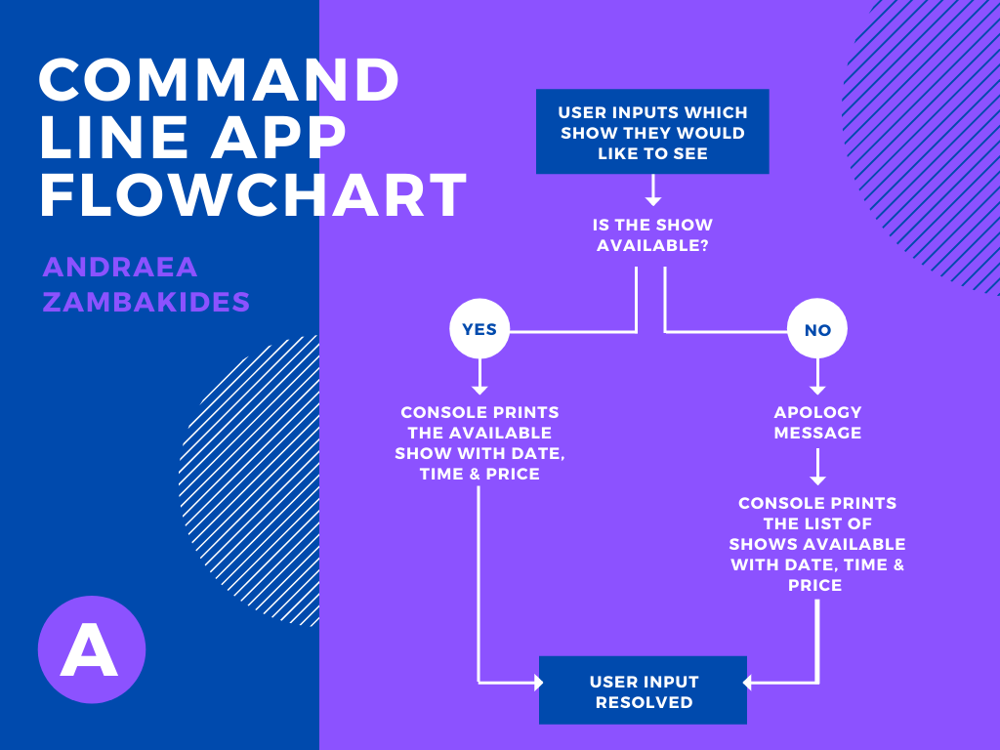

# Theatre Events System
***
A Command Line Application for the development of Theatre Events System using only Java 

## Statement of Purpose

---
**What this application will do:**
  
The aim of this application is to create the development of a Theatre Events System app. Here, users can search for and book theatre shows that they are interested in seeing with ease and simplicity.

**What business problem it addresses:**

The app addresses the problems some users may have with searching for theatre shows in an app. Instead of scrolling through a long list of show titles until they find the one they want, the user can simply search for a show by putting in the name.

**The target audience:**
    
The target audience of this app are fans and lovers of art and culture. Cultured people who want a simple and easy way to search for a show that will be part of their next theatre trip.
  
## Features

---
1. The users type in the name of the show that they want to see into the input
2. If the show they wish to see is available, an output of the name of the show will appear, along with the show date, show time, and price
3. If the desired show is unavailable or if they input a wrongly-named show, the output gives an apology and presents a list of available shows that they could see instead

## Implementation Plan

---
| Step | Process or Task | Members    | Comments | 
|------|------------------|------------|----------|
|1 | Made first commit by creating the repository in GitHub and linking it to Intellji |
|2 | Added the first files of the project set-up | .gitignore, pom.xml, App.java, AppTest.java
|3 | Created three shows: a ballet, a play, and a musical, and printed them to the console| Main Class: Hello world, Show showOne/showTwo/showThree, System.out.prinln (x3). Show: private LocalDateTime and nameOfTheShow, Constructors, Getters/Setters| Also renamed file names of the main class to Main and the test to MainTest|
|4 | Refactored Show to ShowTemplates, created a new class called Show, and added an extra show, totalling in four shows | Main: System.out.Println (x3) with two greetings and on show name only | Testing the printing to the console
|5 | Refactored ShowTemplates to TheatreTemplates, created a new String of three different show times to all four shows, and made new Constructors, and Getters/Setters | TheatreTemplates: Strings, Constructors, Getters/Setters; Show: Public Static linking back to TheatreTemplates with details of the shows
|6|

## Command Line App Flowchart

